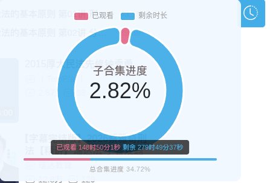

# Changelog

## 1.1.0 - 2026-04-29

- 支持嵌套合集（子合集）单独统计：环状图显示当前子合集进度，底部进度条显示总合集进度 ([#7](https://github.com/AntiO2/Bili-Timer/issues/7))
- 修复嵌套合集中前一个子合集被错误计入"已观看"的问题
- 总合集进度条配色与环状图统一（已观看粉色 / 剩余蓝色），悬浮显示具体时间
- 

## 1.0.3 - 2026-03-21

- Added support for `bangumi` play pages.
- Added support for `cheese` classroom play pages, including locked-course list parsing.
- Added bangumi duration estimation fallback and `(预估)` chart labeling.
- Expanded userscript matches and API access for Bilibili season data.
- Improved floating widget sizing, positioning, and two-line text layout.
- Updated README support notes for bangumi and classroom pages.
